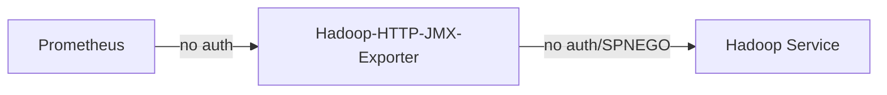

# hadoop-http-jmx-exporter

Scrapes [Hadoop
Metrics](https://hadoop.apache.org/docs/stable/hadoop-project-dist/hadoop-common/Metrics.html)
and exposes them in [Prometheus](https://prometheus.io/) format.

Supports both _simple_ and _SPNEGO_ authentication for the Hadoop endpoints.

> [!WARNING]
> Metrics are exposed over HTTP without any authentication.



## Configuration

Configuration can be provided ether via environment variable:
```bash
JMX_URLS="http://10.0.0.1:8088/jmx,http://10.0.0.1:8042/jmx"
KERBEROS_PRINCIPAL=HTTP/localhost
KERBEROS_REALM=SOME_REALM
KERBEROS_KEYTAB_PATH=/path/to/keytab/with/HTTP/principal
KERBEROS_CONFIG_PATH=/etc/krb5.conf
HTTP_CLIENT_TIMEOUT=10s # default
LISTEN_ADDRESS=0.0.0.0 # default
LISTEN_PORT=9100 # default
```

or a config YAML file:
```yaml
jmx_urls:
    - http://10.0.0.1:8088/jmx
    - http://10.0.0.1:8042/jmx
kerberos_principal: HTTP/localhost
kerberos_realm:  SOME_REALM
kerberos_keytab_path: /path/to/keytab/with/HTTP/principal
kerberos_config_path: /etc/krb5.conf
http_client_timeout: 10s # default
listen_address: 0.0.0.0 # default 
listen_port: 9100 # default 
```

> [!NOTE]
> If _SPNEGO_ should not be used do not set configuration options starting with `kerberos`/`KERBEROS` prefix. The
> bare minimum is to provide `jmx_urls`/`JMX_URLS`.

> [!WARNING]
> Not all metrices are exposed yet.

## Releases

Releases are acommpanied by a Docker image available
[here](https://hub.docker.com/r/zkostrzewa/hadoop-http-jmx-exporter).
